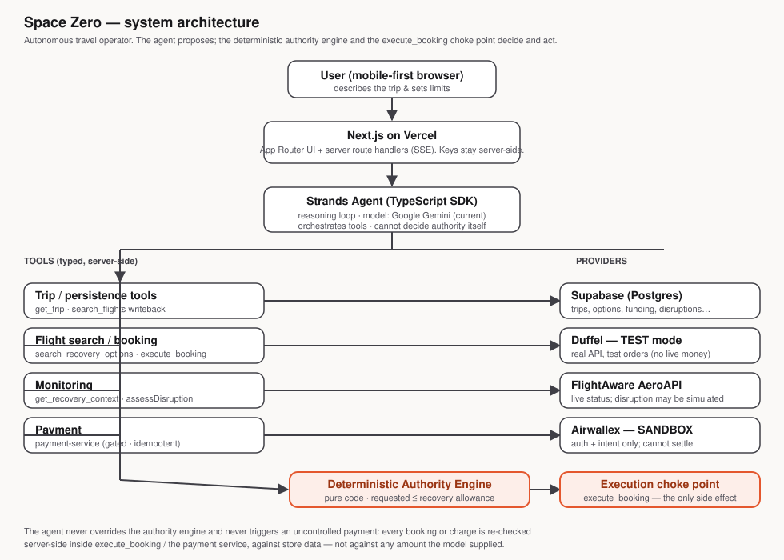

# Space Zero — Architecture

> This document describes the **implemented** system as it exists in this repository.
> For the earlier pre-implementation design record (single-runtime decision, etc.) see
> [`docs/architecture/technical-architecture.md`](architecture/technical-architecture.md).
> Where the two disagree, this file reflects the code that actually runs.



---

## 1. One deployable

Space Zero is a **single Next.js application** deployed on Vercel. The Strands Agents
**TypeScript** SDK runs *server-side* inside Next.js route handlers — there is no
separate Python service and no cross-language boundary. The agent, its tools, the
deterministic authority engine, the trip state machine, persistence, and every provider
adapter are all TypeScript in the same process.

Model credentials and all provider keys are read from the environment on the server and
**never reach the browser**. The browser only ever receives JSON and Server-Sent-Event
(SSE) streams of *user-safe operational events* — never the model's hidden reasoning.

## 2. The request flow

```
User (browser)
  → Next.js route handler (server)
    → Strands Agent (reasoning loop, model = Gemini today)
      → typed tools (get_trip, search_flights, recover_trip, execute_booking, …)
        → Deterministic Authority Engine  (pure code — the model cannot bypass it)
          → Execution choke point: execute_booking / payment-service
            → Providers (Supabase, Duffel, FlightAware, Airwallex)
```

The agent **proposes** actions by calling tools. It does **not** decide whether a spend is
permitted and it cannot move money directly. Every action that spends or books is
re-validated in deterministic server code, against authoritative store data, before any
provider call.

## 3. Roles of each piece

| Layer | Role | Code |
|---|---|---|
| **Next.js / Vercel** | UI (App Router) + server route handlers that run the agent and stream events | `app/**` |
| **Strands Agents SDK** | Runs the agent reasoning loop, tool selection, and streaming | `src/agent/agent.ts`, `@strands-agents/sdk` |
| **Model provider** | The LLM behind the agent. Pluggable via `getModel()` — an env change, not a code change | `src/agent/model.ts` |
| **Tools** | Typed (Zod) functions the agent may call; each delegates to deterministic services | `src/server/tools/**` |
| **Authority engine** | Pure function: `requestedAmount ≤ recoveryAllowance`. Single source of truth for "may spend?" | `src/domain/authority.ts` |
| **Trip state machine** | Validated status transitions (DRAFT → … → CONFIRMED → MONITORING → AT_RISK → RESOLVED) | `src/domain/trip-state.ts` |
| **Booking service** | The real booking orchestration and preconditions gate | `src/server/booking/booking-service.ts`, `src/domain/booking.ts` |
| **Recovery service** | Deterministic disruption recovery (search → evaluate → book/escalate) | `src/server/recovery/**`, `src/domain/recovery.ts` |
| **Payment service** | Money-movement boundary: gate → idempotency → provider → honest reconcile | `src/server/payments/payment-service.ts` |
| **Persistence** | Supabase (Postgres) repositories, with an in-memory fallback for local dev/tests | `src/server/persistence/**` |
| **Providers** | Duffel, FlightAware, Airwallex adapters (server-only) | `src/providers/**` |

### Registered agent tools (`src/server/tools/index.ts`)

`get_trip` · `check_authority` · `recover_trip` · `execute_booking` · `search_flights` ·
`get_recovery_context` · `search_recovery_options` · `evaluate_recovery_options`.

`execute_booking` is the **only** tool with a booking/money side effect.

## 4. The two enforcement invariants

1. **Deterministic authority.** `evaluateAuthority()` is pure, server-side, LLM-free code.
   The model can *request* a spend but the engine decides. It fails closed on invalid input.
2. **Single execution choke point.** All booking flows converge on `execute_booking`, which
   re-loads the authoritative trip + selected offer from the store and re-runs the
   preconditions gate (authorized · option selected · offer still valid · funded · within
   budget) itself. It never trusts a cost, limit, or approval passed by the model. A
   provider failure surfaces honestly and **never** advances a trip to CONFIRMED/RESOLVED.

Recovery adds a parallel gate: `evaluateRecovery()` checks arrival requirement, connection
feasibility, funding, budget, and the recovery allowance deterministically; only an
`AUTO_BOOK` verdict books, otherwise the trip is `ESCALATED` to the traveler.

## 5. Persistence (Supabase)

Trip state, flight options, funding, disruptions, recoveries, and payment audit rows live
in Supabase Postgres. Migrations are applied in order from `supabase/migrations/`:

`0001_init` · `0002_flight_options` · `0003_funding_states` · `0004_booking` ·
`0005_monitoring` · `0006_recovery` · `0007_payments`.

When `SUPABASE_URL` / `SUPABASE_SERVICE_ROLE_KEY` are absent, the repositories fall back to an
in-memory store (used by the test suite and local dev). The service-role key bypasses RLS
and is **server-only** — never `NEXT_PUBLIC_`.

## 6. Providers — real vs simulated (be honest)

| Provider | What is real | What is simulated / limited |
|---|---|---|
| **Duffel** | Real API calls in **TEST mode**: real offer search and real test orders (order id + PNR). | Test-mode orders settle from the Duffel test balance — **not a live booking, no real money**. |
| **FlightAware** | Real AeroAPI status lookups, normalized by the same code the live client uses. | Live APIs can't produce a chosen disruption on demand, so the demo disruption is a **clearly-labelled fixture** through the identical monitoring→recovery pipeline. A simulated disruption is never presented as a live FlightAware event. |
| **Airwallex** | Real **sandbox** auth + a real sandbox payment *intent* is created. | The sandbox account is provisioned for Balances/Transfers (not Online Payments) with no active payment method, so a charge **cannot reach SUCCEEDED**; capture is out of scope. Space Zero never claims a settled payment — a non-SUCCEEDED result stops the flow honestly. |
| **Model (Gemini)** | Real Gemini calls orchestrate the agent. | Subject to account quota; on 429/unavailable the app returns an honest `PROVIDER_UNAVAILABLE` (no fabricated booking). |
| **Amazon Bedrock** | Supported by `getModel()` as a provider option. | **Not operational** in this environment — AWS account/model entitlement is still pending verification, so `MODEL_PROVIDER=bedrock` is not usable today. |

## 7. Security & safety boundaries

- All keys are server-only; the browser receives only operational events, never model reasoning or secrets.
- Errors are mapped to fixed user-safe strings (`toUserSafeError`) — no stack traces, no secrets, no provider internals.
- The authority engine and the `execute_booking` / payment-service choke points are the only places that authorize spend; the agent cannot bypass them.
- Payments are gated (authority + funding) → idempotency-protected → reconciled to the provider's honest status. A retry never double-charges.
- Space Zero is a **hackathon prototype**, not a regulated financial, custody, or payment product, and makes no such claim.
